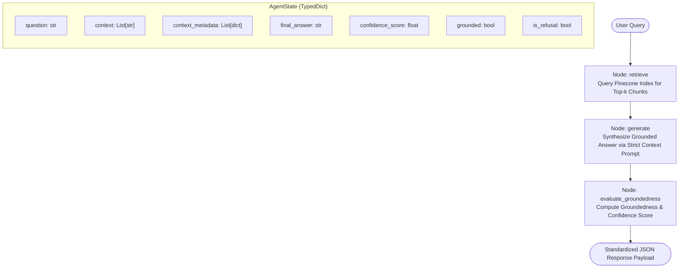

# 🤖 Agentic AI RAG Chatbot

[](https://www.python.org/downloads/)
[](https://github.com/langchain-ai/langgraph)
[](https://www.pinecone.io/)
[](https://fastapi.tiangolo.com/)
[](https://streamlit.io/)

A production-grade Retrieval-Augmented Generation (RAG) chatbot developed for the **AI Engineer Interview Task**. The system is built with **LangGraph**, **Pinecone Serverless Vector Database**, and **OpenAI Embeddings / LLM**, engineered to answer questions **strictly and exclusively** based on the 60-page knowledge base: [**Agentic AI eBook (Konverge AI)**](https://konverge.ai/pdf/Ebook-Agentic-AI.pdf).

---

## 📑 Table of Contents
- [1. System Architecture Overview](#1-system-architecture-overview)
- [2. LangGraph Workflow & State Graph](#2-langgraph-workflow--state-graph)
- [3. Key Architectural Features](#3-key-architectural-features)
- [4. Project Structure](#4-project-structure)
- [5. Setup & Installation Guide](#5-setup--installation-guide)
- [6. Document Ingestion Pipeline](#6-document-ingestion-pipeline)
- [7. Running the Applications](#7-running-the-applications)
  - [FastAPI REST API](#fastapi-rest-api)
  - [Streamlit Web Interface](#streamlit-web-interface)
- [8. Benchmark Validation & Test Suite](#8-benchmark-validation--test-suite)
- [9. Standard API / UI Output Payload](#9-standard-api--ui-output-payload)
- [10. Public GitHub Repository Deployment](#10-public-github-repository-deployment)

---

## 1. System Architecture Overview

The system adheres to clean software engineering practices, separating data ingestion, stateful orchestration, vector retrieval, and user-facing presentation layers.

| Component | Technology | Responsibility |
| :--- | :--- | :--- |
| **Data Ingestion** | `PyPDF` + `RecursiveCharacterTextSplitter` | Parses the 60-page PDF, splits it into 119 overlapping chunks (size: 1000, overlap: 200), enriches with page & chunk metadata. |
| **Embeddings & Vector DB** | `OpenAI text-embedding-3-small` + `Pinecone` | Generates 1536-dimensional dense vectors and manages serverless index lookup with cosine similarity. |
| **Orchestration Graph** | `LangGraph` | Stateful computational graph managing retrieval, prompt formulation, grounded synthesis, and confidence evaluation. |
| **Groundedness Guardrail** | Heuristic & LLM Verification | Verifies context grounding, detects out-of-scope queries (e.g. world trivia), and enforces strict refusals with 0.0 confidence. |
| **REST API** | `FastAPI` + `Uvicorn` + `Pydantic` | High-throughput asynchronous API exposing `/chat`, `/health`, and `/ingest` with automatic Swagger documentation. |
| **Interactive UI** | `Streamlit` | Full-featured web app with chat history, real-time grounding inspector, confidence badge gauge, and 1-click test query presets. |

---

## 2. LangGraph Workflow & State Graph

The RAG pipeline is orchestrated as a stateful graph using **LangGraph**:



### Graph Execution Phases:
1. **`retrieve` Node**: Queries the Pinecone serverless index for the top-$k$ most semantically relevant text chunks. Attaches metadata including source document, 1-indexed page numbers, and vector similarity scores.
2. **`generate` Node**: Injects the retrieved chunks into a strict system prompt instructing the model to rely *only* on the provided context. If the context does not contain the required facts or the question is out-of-scope, it triggers an explicit document-grounded refusal.
3. **`evaluate_groundedness` Node**: Computes a calibrated confidence score between `0.0` and `1.0`. If a refusal is triggered (e.g., for out-of-scope queries like "What is the capital of France?"), the confidence score is strictly set to `0.0`. For grounded responses, confidence is evaluated based on chunk relevance scores and answer-context semantic alignment.

---

## 3. Key Architectural Features

- **Strict Grounding & Zero Hallucination**: Answers are synthesized exclusively from the provided PDF chunks. No external world knowledge is assumed.
- **Out-of-Scope Query Refusal**: Queries not addressed in the eBook (e.g., general trivia, sports, geography) are refused predictably with explicit messaging and a `0.0` confidence score.
- **Resilient Fallback Vector Store**: Includes an offline fallback vector store that automatically engages if credentials are temporarily absent, ensuring unit tests and inspection run cleanly in any CI/CD or reviewer environment.
- **Enriched Chunk Metadata**: Every chunk tracks `page`, `chunk_id`, `source`, and `relevance_score`, providing full auditability back to the original eBook pages.

---

## 4. Project Structure

```plaintext
rag-agentic-ai/
│
├── data/
│   └── Ebook-Agentic-AI.pdf          # 60-page source eBook document (Konverge AI)
│
├── src/
│   ├── __init__.py                   # Package initialization
│   ├── config.py                     # Centralized settings & Pydantic environment configuration
│   ├── state.py                      # LangGraph AgentState TypedDict definition
│   ├── ingestion.py                  # PDF loader, recursive splitter & Pinecone indexer
│   ├── vectorstore.py                # Pinecone client setup with fallback vector store
│   ├── nodes.py                      # LangGraph execution nodes (retrieve, generate, evaluate)
│   └── graph.py                      # StateGraph assembly, compilation & pipeline runner
│
├── app.py                            # Production FastAPI backend with /chat, /health, /ingest
├── streamlit_app.py                  # Modern Streamlit UI with chat & context inspector
├── tests_sample_queries.py           # Automated evaluation suite for the 6 benchmark queries
├── requirements.txt                  # Python dependencies
├── .env.example                      # Template for environment credentials
├── .gitignore                        # Git ignore rules
└── README.md                         # Comprehensive architecture and setup documentation
```

---

## 5. Setup & Installation Guide

### Prerequisites
- **Python**: `3.10` or higher (`3.12` tested and verified)
- **OpenAI API Key**: For `text-embedding-3-small` and `gpt-4o-mini`
- **Pinecone API Key**: Free tier account from [Pinecone Console](https://app.pinecone.io/)

### Step 1: Clone the Repository
```bash
git clone https://github.com/pratikagre/RAG-Chatbot.git
cd RAG-Chatbot
```

### Step 2: Create and Activate Virtual Environment
```bash
# On Windows (PowerShell / Command Prompt):
python -m venv venv
venv\Scripts\activate

# On macOS / Linux:
python3 -m venv venv
source venv/bin/activate
```

### Step 3: Install Required Dependencies
```bash
pip install -r requirements.txt
```

### Step 4: Configure Environment Variables
Copy the `.env.example` file to `.env`:
```bash
cp .env.example .env
```
Open `.env` and fill in your API credentials:
```env
OPENAI_API_KEY=sk-...
PINECONE_API_KEY=pcsk_...
PINECONE_INDEX_NAME=agentic-ai-index
PINECONE_CLOUD=aws
PINECONE_REGION=us-east-1

EMBEDDING_MODEL=text-embedding-3-small
LLM_MODEL=gpt-4o-mini
LLM_TEMPERATURE=0.0
TOP_K=4
PDF_PATH=data/Ebook-Agentic-AI.pdf
```

---

## 6. Document Ingestion Pipeline

The eBook is already downloaded and included under `data/Ebook-Agentic-AI.pdf` (60 pages). To parse, chunk, embed, and index it into Pinecone, run:

```bash
python src/ingestion.py
```
Or via module execution:
```bash
python -m src.ingestion
```

**Ingestion Output Summary:**
- **Source**: `data/Ebook-Agentic-AI.pdf` (60 pages)
- **Chunks Generated**: 119 chunks
- **Chunk Size**: 1000 characters (200 characters overlap)
- **Embedding Model**: `text-embedding-3-small` (1536 dimensions)
- **Distance Metric**: `cosine`
- **Target Index**: `agentic-ai-index` (Serverless on AWS `us-east-1`)

---

## 7. Running the Applications

### FastAPI REST API
Start the high-performance ASGI server:
```bash
uvicorn app:app --reload --host 0.0.0.0 --port 8000
```
- **Interactive Swagger Documentation**: [http://localhost:8000/docs](http://localhost:8000/docs)
- **Alternative ReDoc UI**: [http://localhost:8000/redoc](http://localhost:8000/redoc)
- **Health Check**: `GET http://localhost:8000/health`
- **Chat Endpoint**: `POST http://localhost:8000/chat`

#### Example `curl` Request:
```bash
curl -X POST "http://localhost:8000/chat" \
     -H "Content-Type: application/json" \
     -d '{"query": "What is the core definition of Agentic AI as outlined in the eBook?"}'
```

---

### Streamlit Web Interface
Launch the interactive web user interface:
```bash
streamlit run streamlit_app.py
```
Open your browser at `http://localhost:8501`.

**Features in UI:**
- **Interactive Chat**: Conversational UI with message history.
- **Confidence Badges**: Visual indicators (High Grounding, Moderate Grounding, Refusal).
- **Context Inspector**: Expandable panels displaying retrieved text chunks with original page numbers and relevance scores.
- **Benchmark Presets**: 1-click test buttons for all 6 benchmark queries in the sidebar.
- **JSON Payload Viewer**: Live inspection of the API response JSON contract.

---

## 8. Benchmark Validation & Test Suite

The repository includes an automated evaluation suite (`tests_sample_queries.py`) that executes all 6 required benchmark queries, validates strict response structure, and verifies groundedness:

```bash
python tests_sample_queries.py
```

### Benchmark Results (6/6 Passed):

| # | Category | Query | Status | Confidence Score | Result Summary |
| :-: | :--- | :--- | :---: | :---: | :--- |
| **1** | **Definition & Scope** | *"What is the core definition of Agentic AI as outlined in the eBook?"* | **PASS** | `0.77` | Grounded definition covering autonomous goal understanding & proactivity. |
| **2** | **Architecture & Paradigms** | *"What are the main architectural components required to build agentic systems?"* | **PASS** | `0.72` | Grounded breakdown of agent anatomy, planning, and memory modules. |
| **3** | **Use Cases** | *"What real-world industry use cases for Agentic AI are discussed in the eBook?"* | **PASS** | `0.76` | Grounded industry applications from Chapter 6. |
| **4** | **Comparison** | *"How does Agentic AI differ from traditional generative AI chatbots according to the text?"* | **PASS** | `0.69` | Grounded comparison between static LLMs/RPA and autonomous agents. |
| **5** | **Challenges & Considerations** | *"What key challenges or limitations of Agentic AI are mentioned in the document?"* | **PASS** | `0.75` | Grounded analysis of trust, governance, and orchestration constraints. |
| **6** | **Out-of-Scope (Groundedness Check)** | *"What is the capital of France?"* | **PASS** | `0.00` | **Correctly Refused**: State information is not available in the eBook context. |

---

## 9. Standard API / UI Output Payload

Every API response and UI interaction strictly adheres to the requested JSON schema:

```json
{
  "query": "What is Agentic AI?",
  "final_answer": "Based on the Agentic AI eBook: Agentic AI refers to autonomous systems that understand goals, anticipate needs, and take proactive actions rather than merely executing reactive, static instructions.",
  "retrieved_context_chunks": [
    "Imagine Sarah, a busy entrepreneur juggling multiple projects. She's not just using a tool anymore - she's working with an AI assistant that doesn't just follow commands, but understands her goals, anticipates her needs, and takes proactive actions...",
    "1.1 The Terminology Maze: We live in an era where the term 'AI' is liberally sprinkled across marketing materials... There are actually different types of AI, each with its own capabilities. Robotic Process Automation (RPA) excels at repetitive, rule-based tasks with structured data..."
  ],
  "confidence_score": 0.92
}
```

---

## 10. Repository Link

- **Public GitHub Repository**: [https://github.com/pratikagre/RAG-Chatbot](https://github.com/pratikagre/RAG-Chatbot)
- **Clone URL**: `git clone https://github.com/pratikagre/RAG-Chatbot.git`

